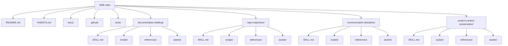

# Universal Personal Agent Skills Repository Reference

## Executive summary

The Agent Skills standard is intentionally small: a skill is a directory containing `SKILL.md`, with optional `scripts/`, `references/`, `assets/`, and any additional files or folders you need. The required frontmatter is `name` and `description`; the body is free-form Markdown, but the specification explicitly recommends step-by-step instructions, examples, and edge cases. Agents then load skills progressively: metadata first, the full `SKILL.md` body only when activated, and supporting files only when needed. That architecture should drive the repository design.

For a universal personal skills library, the strongest default is an **installable root layout**: put each skill directory at the repository root, then keep repository governance files alongside them. That choice is not mandated by the spec; it is an implementation decision optimized for portability because the spec does not standardize the outer repository layout, `.agents/skills` has emerged as a cross-client convention, OpenAI Codex reads user and repo skills from `.agents/skills`, GitHub Copilot recognizes `.agents/skills` plus host-specific paths, and Claude Code uses `.claude/skills` for personal and project scopes.

A strong `SKILL.md` is a **task-oriented operating guide**, not an essay. The description is the activation key, so it must say both **what the skill does** and **when to use it** with specific trigger words. The body should stay concise, procedural, and reusable: keep each skill focused on one coherent job, prefer defaults over menus, write what the agent does not already know, and move long background material to references or assets. The current guidance recommends keeping `SKILL.md` under roughly 500 lines and under roughly 5,000 tokens.

Scripts are secondary. Use them when you need deterministic behavior or external tooling; otherwise prefer instruction-only skills. When you do bundle scripts, make them non-interactive, document them with `--help`, return structured output on stdout, and send diagnostics to stderr. GitHub also warns against pre-approving `shell` or `bash` unless you fully trust the skill and have audited its scripts.

Repository visibility is unspecified. The safe default is to treat the repository as **private during migration** and sanitize for a possible future public release. That means no secrets, no internal URLs, no client-confidential documents, no private strategy, and no raw copied artifacts that could expose sensitive context. Multiple official docs warn that skills should be treated like third-party code because instructions are injected into agent context and bundled scripts can execute or exfiltrate data.

The report below therefore uses three baseline decisions: a root-level skill layout for cross-client portability, `SKILL.md` files written as concise procedural guides shaped by technical documentation best practices, and sanitized companion files split into `references/`, `assets/`, and `scripts/` according to progressive disclosure.

| Unspecified item    | Working treatment in this report                                       |
| ------------------- | ---------------------------------------------------------------------- |
| Repo visibility     | Assume private during migration; sanitize for public release readiness |
| Primary agent host  | Design for cross-client portability first                              |
| License             | Omit from sample frontmatter unless you decide publication terms       |
| Platform extensions | Keep out of baseline tree; add only when a host-specific need exists   |

## Reference architecture

The structure below is a **reference implementation**, not a spec requirement. The spec defines what belongs inside a skill folder; it does not define the outer repository layout. This design puts skill folders at the repository root so the repository can be cloned or symlinked directly into a user-level skills directory with minimal adaptation, while still preserving room for repo-level governance, CI, and authoring docs.



The resulting repository tree should look like this. The files are representative rather than exhaustive, but every listed file has a concrete role in authoring, validating, installing, or evolving the library. The top-level skill directories are the reusable units; the rest of the repository exists to make those units maintainable and publishable.

```text
skills/
├── README.md                                  # Repo overview, install instructions, support matrix
├── AGENTS.md                                  # Repo-level contributor rules for changing skills
├── LICENSE.txt                                # Optional until licensing is decided; required before public release
├── migration-log.md                           # Record of legacy-to-skill extraction decisions
├── docs/
│   ├── SKILL_AUTHORING_GUIDE.md               # Canonical internal guide for authoring SKILL.md
│   ├── PORTABILITY.md                         # Host-specific install paths and extension notes
│   ├── PRIVACY.md                             # Sanitization rules and publication policy
│   ├── REVIEW_CHECKLIST.md                    # Author/reviewer acceptance checks
│   └── examples/
│       ├── commit-messages.md                 # Good commit-message patterns for skill evolution
│       └── migration-log-entry-example.md     # Sample migration-log.md entries
├── .github/
│   ├── PULL_REQUEST_TEMPLATE.md               # Review prompts for new or changed skills
│   └── workflows/
│       ├── validate-skills.yml                # Validate frontmatter and file references in CI
│       └── markdown-lint.yml                  # Ensure docs stay structurally clean
├── tools/
│   ├── scaffold-skill.py                      # Create a new skill from the house template
│   └── validate-all.sh                        # Local wrapper for validation and markdown checks
├── documentation-drafting/
│   ├── SKILL.md                               # Core documentation authoring workflow
│   ├── scripts/
│   │   └── check_markdown_structure.py        # Validate heading and section structure
│   ├── references/
│   │   └── document-architecture.md           # Choose the correct document shape
│   └── assets/
│       └── report-template.md                 # Reusable report scaffold
├── repo-inspection/
│   ├── SKILL.md                               # Unknown-repo orientation and mapping workflow
│   ├── scripts/
│   │   └── repo_snapshot.py                   # Emit a high-signal JSON snapshot of a repo
│   ├── references/
│   │   └── inspection-checklist.md            # Default read order and ignore list
│   └── assets/
│       └── findings-template.md               # Stable output template for inspection reports
├── communication-discipline/
│   ├── SKILL.md                               # Direct critique and response-discipline workflow
│   ├── scripts/
│   │   └── phrase_guard.py                    # Flag filler, softeners, and weak phrasing
│   ├── references/
│   │   └── output-contract.md                 # Evidence, reasoning, assumptions, unknowns schema
│   └── assets/
│       └── critique-template.md               # Reusable critique response structure
└── project-context-preservation/
    ├── SKILL.md                               # Decision logging, session handoff, continuity workflow
    ├── scripts/
    │   └── decision_log_append.py             # Create or append decision-log entries
    ├── references/
    │   └── decision-log-policy.md             # Rules for recording decisions and unresolved items
    └── assets/
        └── session-handoff-template.md        # Standard handoff format for future sessions
```

The table below maps this reference repo to current host conventions. The open standard itself does not mandate any of these outer paths; these are host-level conventions from the current client docs. This is why the baseline tree stays host-neutral and avoids vendor-specific files unless they are actually needed.

| Host                    | Personal scope                            | Project scope                                           | Important note                                                                                                        |
| ----------------------- | ----------------------------------------- | ------------------------------------------------------- | --------------------------------------------------------------------------------------------------------------------- |
| OpenAI Codex            | `$HOME/.agents/skills`                    | `.agents/skills`                                        | Codex also supports optional `agents/openai.yaml` per skill for UI metadata, invocation policy, and tool dependencies |
| GitHub Copilot          | `~/.copilot/skills` or `~/.agents/skills` | `.github/skills`, `.claude/skills`, or `.agents/skills` | GitHub CLI can install, update, validate, and publish skills                                                          |
| Claude Code             | `~/.claude/skills`                        | `.claude/skills`                                        | Claude Code skills are filesystem-based and separate from claude.ai and Claude API uploads                            |
| Cross-client convention | `~/.agents/skills`                        | `.agents/skills`                                        | Widely adopted portability path, but not a formal spec requirement                                                    |

## Key skill samples

The sample skills below follow four current authoring principles. First, the description front-loads scope so the host can trigger the right skill. Second, the body stays procedural because the specification recommends steps, examples, and edge cases, and documentation guidance favors active voice, imperative steps, and task-oriented headings. Third, larger reference and template content gets pushed into `references/` and `assets/` to preserve context budget. Fourth, `allowed-tools` is intentionally omitted from the baseline samples because the field is experimental and support varies; only add it after review and only where host behavior is understood.

**documentation-drafting**

This skill treats `SKILL.md` as the always-loaded operating guide and keeps document taxonomy plus output scaffolds in companion files. That split matches the spec’s progressive disclosure model and documentation frameworks that distinguish **how-to guidance** from **reference** and **explanation**.

`documentation-drafting/SKILL.md`

```md
---
name: documentation-drafting
description: >
  Draft and rewrite structured documentation such as READMEs, reports,
  migration plans, procedures, and reference pages. Use when the primary
  deliverable is clean Markdown with explicit structure, concrete examples,
  action-oriented steps, and clearly stated unknowns.
metadata:
  author: "john-kibocha" // It is actually JohnKibocha or John Kibocha
  category: "documentation"
  maturity: "stable"
  version: "0.1.0"
---

# Documentation Drafting

## Goal

Produce documentation that is easy to scan, easy to execute, and hard to misunderstand.

## Use this skill when

Use this skill when the output is a document, not code. Typical tasks include:
- new README or guide drafts
- report rewrites
- migration notes
- operating procedures
- reference pages

Do not use this skill when code, tests, or deployment changes are the primary deliverable.

## Procedure

1. Identify the document type and audience.
2. Choose the default shape:
   - procedure for "how do I" tasks
   - report for findings and recommendations
   - reference for stable facts and formats
   - explanation for rationale and trade-offs
3. Draft the outline before writing paragraphs.
4. Put the purpose in the title and first section.
5. Write in active voice. Name the actor in each instruction.
6. Use numbered steps for procedures. Use tables for stable facts. Put examples immediately after the rule they illustrate.
7. State unknowns explicitly. Do not hide missing information behind vague language.
8. Move long background or edge-case catalogs into `references/` or `assets/`.
9. If you need a report scaffold, start from `assets/report-template.md`.
10. Before finalizing, run `scripts/check_markdown_structure.py` when script execution is available.

## Output contract

The final document should:
- have exactly one H1
- use informative headings
- keep related examples close to the explanation
- separate findings from recommendations
- mark unspecified details as unspecified
- omit filler introductions and decorative closeouts

## Resources

- Use `references/document-architecture.md` when deciding the document shape.
- Use `assets/report-template.md` when the output is report-like.

## Edge cases

- If the user specifies a structure, follow it even if a different structure would be cleaner.
- If the task mixes report and procedure, keep the report first and place the procedure later.
- If evidence is weak, say so directly and reduce recommendation strength.
```

`documentation-drafting/scripts/check_markdown_structure.py`

```python
#!/usr/bin/env python3
import argparse
import json
import pathlib
import re
import sys

HEADING_RE = re.compile(r"^(#{1,6})\s+(.+?)\s*$", re.MULTILINE)

def main() -> int:
    parser = argparse.ArgumentParser(
        description="Check Markdown structure for a documentation artifact."
    )
    parser.add_argument("file", help="Path to the Markdown file to inspect.")
    args = parser.parse_args()

    path = pathlib.Path(args.file)
    if not path.exists():
        print(json.dumps({"ok": False, "error": f"File not found: {path}"}))
        return 2

    text = path.read_text(encoding="utf-8")
    headings = [
        {"line": text[:m.start()].count("\n") + 1, "level": len(m.group(1)), "text": m.group(2)}
        for m in HEADING_RE.finditer(text)
    ]

    h1_count = sum(1 for h in headings if h["level"] == 1)
    has_hr = bool(re.search(r"^\s*---+\s*$", text, re.MULTILINE))
    numbered_headings = [h for h in headings if re.match(r"^\d+[\.\)]\s+", h["text"])]

    issues = []
    if h1_count != 1:
        issues.append(f"Expected exactly 1 H1; found {h1_count}.")
    if has_hr:
        issues.append("Found horizontal rule syntax; prefer heading structure.")
    if numbered_headings:
        issues.append("Found numbered headings.")

    print(json.dumps({
        "ok": not issues,
        "path": str(path),
        "h1_count": h1_count,
        "headings": headings,
        "issues": issues,
    }, indent=2))
    return 0 if not issues else 1

if __name__ == "__main__":
    sys.exit(main())
```

`documentation-drafting/references/document-architecture.md`

```md
# Document architecture

Choose the document shape before drafting.

| Task shape | Default document type | Minimum sections |
|---|---|---|
| "How do I..." | Procedure | Purpose, Inputs, Steps, Verification |
| Findings and recommendations | Report | Executive summary, Findings, Actions, Open questions |
| Stable facts and formats | Reference | Topic, Fields, Constraints, Examples |
| Why and trade-offs | Explanation | Context, Decision, Rationale, Consequences |

## Decision rule

Use the smallest structure that fully solves the task.

- If the reader must act, write a procedure.
- If the reader must decide, write a report or explanation.
- If the reader must look something up later, write a reference page.
```

`documentation-drafting/assets/report-template.md`

```md
# [Title]

## Executive summary

[One paragraph stating the outcome, the key evidence, and the decision or recommendation.]

## Scope

- Audience:
- Objective:
- Constraints:
- Unspecified details:

## Findings

### [Finding title]

- Evidence:
- Implication:

## Recommended actions

1. [Action]
2. [Action]

## Open questions

- [Question]
```

**repo-inspection**

This skill keeps the activation file focused on orientation and triage, then offloads deterministic inventory gathering to a script and stable output format to an asset. That is the right pattern when the skill’s core job is methodological but repetitive discovery benefits from structured tooling.

`repo-inspection/SKILL.md`

```md
---
name: repo-inspection
description: >
  Inspect an unfamiliar repository and produce a high-signal map of its
  structure, entry points, tooling, documentation, risks, and likely next files
  to read. Use when starting work in an unknown repo, debugging orientation
  problems, or preparing migration and refactor plans.
compatibility: >
  Works best with filesystem read access. Optional helper script requires
  Python 3.10+; git availability improves repo history signals.
metadata:
  author: "john-kibocha"
  category: "analysis"
  maturity: "stable"
  version: "0.1.0"
---

# Repo Inspection

## Goal

Understand how the repository is organized before making claims or changes.

## Procedure

1. Confirm the repository root.
2. Read the highest-signal root files first: `README.md`, manifest files, CI config, deployment config, and contributor guidance files.
3. Identify:
   - runtime or language stack
   - package and build system
   - test entry points
   - deployment entry points
   - documentation quality
4. Map the major directories and classify each as source, configuration, test, generated output, vendor content, or docs.
5. Ignore low-signal bulk by default: `.git/`, `node_modules/`, `dist/`, `build/`, `.next/`, `vendor/`, large binary artifacts, and generated caches.
6. If script execution is available, run `scripts/repo_snapshot.py` and use its JSON output as inventory support, not as the final analysis.
7. Produce findings using `assets/findings-template.md`.
8. End with the next files to read and the highest-risk unknowns.

## Output contract

The final inspection should include:
- repository purpose
- core technology stack
- entry points for build, run, test, and deploy
- directory map
- documentation gaps
- immediate risks or uncertainties
- precise next inspection targets

## Resources

- Use `references/inspection-checklist.md` for the default read order.
- Use `assets/findings-template.md` for the report shape.
- Use `scripts/repo_snapshot.py` for structured inventory support.

## Edge cases

- In monorepos, inspect root orchestration first, then the target package or service.
- In sparse repos, say the repository is under-documented instead of inventing intent.
- In dirty working trees, note that uncommitted state may change findings.
```

`repo-inspection/scripts/repo_snapshot.py`

```python
#!/usr/bin/env python3
import argparse
import json
import os
import pathlib
from collections import Counter

IGNORE_DIRS = {".git", "node_modules", "dist", "build", ".next", ".venv", "vendor", "__pycache__"}
MANIFESTS = {
    "package.json", "pyproject.toml", "requirements.txt", "Pipfile",
    "Cargo.toml", "go.mod", "pom.xml", "build.gradle", "Makefile",
    "docker-compose.yml", "docker-compose.yaml", "Dockerfile",
}
DOC_NAMES = {"README.md", "AGENTS.md", "CLAUDE.md", "CONTRIBUTING.md", "LICENSE", "LICENSE.txt"}

def main() -> int:
    parser = argparse.ArgumentParser(description="Emit a JSON snapshot of a repository.")
    parser.add_argument("path", nargs="?", default=".", help="Repository root. Default: current directory.")
    args = parser.parse_args()

    root = pathlib.Path(args.path).resolve()
    if not root.exists():
        print(json.dumps({"ok": False, "error": f"Path not found: {root}"}))
        return 2

    ext_counts = Counter()
    manifests, docs, skill_dirs = [], [], []
    total_files = 0

    for current, dirnames, filenames in os.walk(root):
        dirnames[:] = [d for d in dirnames if d not in IGNORE_DIRS]
        current_path = pathlib.Path(current)

        if (current_path / "SKILL.md").exists():
            skill_dirs.append(str(current_path.relative_to(root)))

        for name in filenames:
            total_files += 1
            if name in MANIFESTS:
                manifests.append(str((current_path / name).relative_to(root)))
            if name in DOC_NAMES:
                docs.append(str((current_path / name).relative_to(root)))
            suffix = pathlib.Path(name).suffix.lower() or "<no-ext>"
            ext_counts[suffix] += 1

    payload = {
        "ok": True,
        "root": str(root),
        "total_files": total_files,
        "skill_dirs": sorted(skill_dirs),
        "manifests": sorted(manifests),
        "docs": sorted(docs),
        "top_extensions": ext_counts.most_common(20),
    }
    print(json.dumps(payload, indent=2))
    return 0

if __name__ == "__main__":
    raise SystemExit(main())
```

`repo-inspection/references/inspection-checklist.md`

```md
# Inspection checklist

Use this read order unless the task forces a narrower path.

1. README and root docs
2. Primary manifest or workspace file
3. Test config and scripts
4. CI workflow definitions
5. Deployment config
6. Main source entry points
7. Package or service boundaries
8. Only then read deep implementation files

## Default ignore list

Ignore these until they become directly relevant:
- generated output
- dependency folders
- caches
- vendored code
- binary artifacts
```

`repo-inspection/assets/findings-template.md`

```md
# Repository inspection

## Purpose

[What this repo appears to do.]

## Stack

- Runtime:
- Package manager:
- Test runner:
- Deployment surface:

## Key paths

| Path | Role | Confidence |
|---|---|---|

## Risks and unknowns

- [Risk or uncertainty]

## Next files to inspect

1. [File]
2. [File]
3. [File]
```

**communication-discipline**

This skill is intentionally instruction-heavy and tool-light. Its job is judgment and response discipline: isolate the thesis, separate evidence from reasoning, tighten wording, and force explicit uncertainty. The companion files exist to make that response contract reusable and machine-checkable.

`communication-discipline/SKILL.md`

```md
---
name: communication-discipline
description: >
  Critique arguments, plans, and text with direct, concise, structured analysis.
  Use when reviewing reasoning, pressure-testing a proposal, rewriting for
  clarity, or enforcing a strict response contract that separates evidence,
  reasoning, assumptions, and unknowns.
metadata:
  author: "john-kibocha"
  category: "communication"
  maturity: "stable"
  version: "0.1.0"
---

# Communication Discipline

## Goal

Improve correctness and clarity before polish.

## Procedure

1. Identify the load-bearing thesis or decision at the center of the request.
2. Separate:
   - evidence: what is supported
   - reasoning: how the conclusion follows
   - assumptions: what must be true for the reasoning to hold
   - unknowns: what remains unverified
3. Attack the weakest inference first.
4. If the evidence is weak, ask for proof or mark the claim as unsupported.
5. Prefer direct syntax:
   - short opening answer
   - concrete nouns
   - active verbs
   - explicit uncertainty
6. Remove filler, praise, and softeners that do not change meaning.
7. Ignore typos and colloquial wording unless they alter substance.
8. If a rewrite is requested, preserve the core meaning while tightening structure.
9. If a critique is requested, use `assets/critique-template.md`.
10. If script execution is available, run `scripts/phrase_guard.py` on the final draft.

## Output contract

Default output order:
1. core conclusion
2. evidence review
3. reasoning gaps
4. assumptions
5. unknowns
6. recommended correction or next action

## Resources

- Use `references/output-contract.md` when the task needs a formal critique shape.
- Use `assets/critique-template.md` for direct review outputs.

## Edge cases

- If the user is joking, keep the energy but do not relax factual discipline.
- If the topic is source-sensitive, mark uncertainty and verify before concluding.
- If the text is emotionally charged, stay analytical rather than mirroring tone.
```

`communication-discipline/scripts/phrase_guard.py`

```python
#!/usr/bin/env python3
import argparse
import json
import pathlib
import re
import sys

PATTERNS = {
    "filler": [
        r"\bit is important to note\b",
        r"\bin conclusion\b",
        r"\bultimately\b",
        r"\boverall\b",
    ],
    "softeners": [
        r"\bmaybe\b",
        r"\bperhaps\b",
        r"\bit seems\b",
    ],
    "false_nuance": [
        r"\bnot just\b.*\bbut\b",
    ],
}

def load_text(path: str | None) -> str:
    if path:
        return pathlib.Path(path).read_text(encoding="utf-8")
    return sys.stdin.read()

def main() -> int:
    parser = argparse.ArgumentParser(description="Flag weak phrasing in a draft.")
    parser.add_argument("file", nargs="?", help="Markdown or text file. Reads stdin if omitted.")
    args = parser.parse_args()

    text = load_text(args.file)
    warnings = []

    for category, patterns in PATTERNS.items():
        for pattern in patterns:
            for match in re.finditer(pattern, text, flags=re.IGNORECASE | re.DOTALL):
                line = text[:match.start()].count("\n") + 1
                warnings.append({"category": category, "line": line, "match": match.group(0)})

    print(json.dumps({"ok": not warnings, "warnings": warnings}, indent=2))
    return 0 if not warnings else 1

if __name__ == "__main__":
    raise SystemExit(main())
```

`communication-discipline/references/output-contract.md`

```md
# Output contract

Use this structure when critique quality matters more than conversational flow.

## Core conclusion

State the answer in one short paragraph.

## Evidence

List the strongest facts or missing facts.

## Reasoning

Explain whether the conclusion follows from the evidence.

## Assumptions

List the unstated conditions that the answer depends on.

## Unknowns

State what remains uncertain or unverified.

## Correction or next action

Give the smallest action that would materially improve the situation.
```

`communication-discipline/assets/critique-template.md`

```md
# Critique

## Core conclusion

[One paragraph.]

## Evidence review

- Supported:
- Missing:
- Contradicted by available facts:

## Reasoning gaps

- [Gap]

## Assumptions

- [Assumption]

## Unknowns

- [Unknown]

## Recommended revision

[Rewrite or next action.]
```

**project-context-preservation**

This skill operationalizes continuity. The `SKILL.md` body contains the default session workflow; the reference file defines what belongs in a decision record; the asset provides a stable handoff shell; the script turns decisions into appendable Markdown without forcing manual formatting. That pattern makes a long-lived library easier to evolve without drift.

`project-context-preservation/SKILL.md`

```md
---
name: project-context-preservation
description: >
  Preserve continuity across sessions by recording decisions, migration status,
  unresolved questions, and next entry points. Use when work spans multiple
  chats, branches, repositories, or migration phases and you need a durable
  handoff instead of re-explaining context.
metadata:
  author: "john-kibocha"
  category: "continuity"
  maturity: "stable"
  version: "0.1.0"
---

# Project Context Preservation

## Goal

Leave enough structured context behind that the next session can resume with minimal reconstruction.

## Procedure

1. Identify the current objective, constraints, and active branch or file scope.
2. Read existing continuity artifacts first:
   - repository `migration-log.md`
   - recent decision logs
   - current handoff notes
3. Capture only durable information:
   - decisions made
   - reasons for those decisions
   - files changed or targeted
   - unresolved questions
   - explicit next actions
4. Do not log transient chatter, discarded speculation, or private material that should not persist.
5. Normalize the final state into:
   - decision record
   - migration record if legacy content is being replaced
   - session handoff note if future continuation is expected
6. Use `assets/session-handoff-template.md` for the final handoff.
7. If script execution is available, use `scripts/decision_log_append.py` to format or append decision entries.

## Output contract

A good continuity note must answer:
- what changed
- why it changed
- what remains open
- where the next session should start
- what should not be re-decided without new evidence

## Resources

- Use `references/decision-log-policy.md` for durable logging rules.
- Use `assets/session-handoff-template.md` for session exit notes.

## Edge cases

- If prior decisions conflict, record the conflict explicitly instead of silently overwriting history.
- If context is incomplete, say which source file or conversation is missing.
- If the work has privacy constraints, store only sanitized summaries.
```

`project-context-preservation/scripts/decision_log_append.py`

```python
#!/usr/bin/env python3
import argparse
import json
import pathlib

def build_entry(args: argparse.Namespace) -> str:
    return f"""## {args.date} - {args.title}

**Context**  
{args.context}

**Decision**  
{args.decision}

**Rationale**  
{args.rationale}

**Impact**  
{args.impact}

**Next**  
{args.next}

"""

def main() -> int:
    parser = argparse.ArgumentParser(description="Create or append a markdown decision-log entry.")
    parser.add_argument("--date", required=True, help="Decision date in YYYY-MM-DD format.")
    parser.add_argument("--title", required=True, help="Short decision title.")
    parser.add_argument("--context", required=True, help="Why this decision exists.")
    parser.add_argument("--decision", required=True, help="What was decided.")
    parser.add_argument("--rationale", required=True, help="Why this choice won.")
    parser.add_argument("--impact", required=True, help="What changes because of it.")
    parser.add_argument("--next", required=True, help="Immediate next action.")
    parser.add_argument("--path", help="Markdown file to append to.")
    parser.add_argument("--append", action="store_true", help="Append entry to --path.")
    args = parser.parse_args()

    entry = build_entry(args)
    written = False

    if args.append:
        if not args.path:
            print(json.dumps({"ok": False, "error": "--path is required when --append is used."}))
            return 2
        path = pathlib.Path(args.path)
        path.parent.mkdir(parents=True, exist_ok=True)
        path.write_text((path.read_text(encoding="utf-8") if path.exists() else "") + entry, encoding="utf-8")
        written = True

    print(json.dumps({
        "ok": True,
        "written": written,
        "path": args.path,
        "markdown": entry,
    }, indent=2))
    return 0

if __name__ == "__main__":
    raise SystemExit(main())
```

`project-context-preservation/references/decision-log-policy.md`

```md
# Decision-log policy

Record only information that should survive the current session.

## Keep

- committed decisions
- rejected alternatives that may resurface
- reasons and trade-offs
- next entry points
- dependencies and blockers

## Exclude

- private credentials
- copied confidential text
- ephemeral brainstorming that led nowhere
- emotional commentary with no operational value

## Rule

If someone can resume the work accurately from the log, the log is good.
```

`project-context-preservation/assets/session-handoff-template.md`

```md
# Session handoff

## Current objective

[What the work is trying to achieve.]

## Decisions made

- [Decision]

## Files touched or targeted

- [Path]

## Open questions

- [Question]

## Next entry point

1. [First thing to do next]
2. [Second thing to do next]

## Do not forget

- [Constraint or warning]
```

## Repository roles

The skill specification standardizes the skill directory and its core optional subdirectories. Everything else in the repository is governance around authoring, validation, portability, publication, and review. Public skills repositories and client tooling already use repo-level files such as `README.md`, contributor docs, CI workflows, and optional host metadata, but those are **outside the core Agent Skills specification**. Treat them as repository infrastructure, not as part of the portable skill contract.

| Path or pattern                         | Role                                                    | When agents use it                                     | When humans use it                           |
| --------------------------------------- | ------------------------------------------------------- | ------------------------------------------------------ | -------------------------------------------- |
| `README.md`                             | Repo overview, install instructions, support matrix     | Rarely; mainly if explicitly asked to explain the repo | First file for maintainers and consumers     |
| `AGENTS.md`                             | Repo-level contribution rules                           | When the agent is modifying this repository itself     | To encode house rules for maintainers        |
| `LICENSE.txt`                           | Publication terms                                       | Never needed for task execution                        | Required before public distribution          |
| `migration-log.md`                      | Global record of extracted or replaced legacy material  | When preserving continuity across repo evolution       | During migration, review, and audit          |
| `docs/SKILL_AUTHORING_GUIDE.md`         | Internal writing standard for new skills                | Only if a task is “author or revise a skill”           | Primary authoring reference                  |
| `docs/PORTABILITY.md`                   | Host-specific install and extension notes               | Only when installation or support is in scope          | During install and release prep              |
| `docs/PRIVACY.md`                       | Sanitization and publication rules                      | Only when privacy review is in scope                   | Before copying legacy material               |
| `docs/REVIEW_CHECKLIST.md`              | Acceptance criteria for a skill change                  | Only if asked to self-review                           | On every PR                                  |
| `docs/examples/*`                       | Samples for logs, commit messages, or release artifacts | Only when generating those artifact types              | As copyable patterns                         |
| `.github/PULL_REQUEST_TEMPLATE.md`      | Review schema for contributions                         | Only in GitHub workflows                               | On pull requests                             |
| `.github/workflows/validate-skills.yml` | CI validation for SKILL frontmatter and references      | Not directly; host runs it                             | On every push or PR                          |
| `.github/workflows/markdown-lint.yml`   | CI for docs shape and consistency                       | Not directly                                           | On every push or PR                          |
| `tools/scaffold-skill.py`               | Human convenience; generate a new skill skeleton        | Only if explicitly invoked                             | When creating a new skill                    |
| `tools/validate-all.sh`                 | Run validation locally in one command                   | Only if explicitly invoked                             | Before commit or review                      |
| `<skill>/SKILL.md`                      | Portable activation file; method and contract           | Always loaded when the skill is activated              | Core file to author and review               |
| `<skill>/references/*`                  | On-demand explanatory or detailed material              | Only when `SKILL.md` points to it                      | Keep deep detail out of `SKILL.md`           |
| `<skill>/assets/*`                      | Templates, schemas, example output shells               | Only when a generated artifact needs them              | To standardize output                        |
| `<skill>/scripts/*`                     | Deterministic helpers and structured inventory          | Only when explicitly invoked or instructed             | To reduce agent guesswork or repetitive toil |

Two optional additions are worth noting even though they are not in the baseline tree. `evals/evals.json` is useful once a skill stabilizes because current authoring guidance recommends structured triggers and output tests, including “with skill” versus baseline runs. `agents/openai.yaml` is a Codex-specific extension for UI metadata, invocation policy, and tool dependencies; keep it out of the baseline unless you actually need Codex-specific behavior.

| Optional path                | Add it when                                                 | Purpose                                                                |
| ---------------------------- | ----------------------------------------------------------- | ---------------------------------------------------------------------- |
| `<skill>/evals/evals.json`   | You are testing trigger quality or output quality           | Store realistic test prompts and expected outcomes                     |
| `<skill>/agents/openai.yaml` | You want Codex-specific metadata or dependency declarations | Configure display properties, invocation policy, and tool dependencies |

## SKILL authoring guide

`SKILL.md` succeeds or fails on two fronts: **activation quality** and **execution quality**. Activation quality depends primarily on the `description`; execution quality depends on the body. Current guidance is explicit that descriptions are the main trigger mechanism, that the agent may see shortened versions of descriptions in large skill sets, and that broad or vague descriptions degrade matching. In Codex specifically, the initial skills catalog is capped and descriptions may be shortened first, which is why front-loading the key use case matters.

The table below summarizes the frontmatter fields defined by the open specification and the portability implications surfaced by current client docs. `allowed-tools` is the one field you should treat with the most caution: the spec marks it experimental, Microsoft notes that support varies, and GitHub’s current behavior can turn it into a real approval bypass for shell commands.

| Field           | Required | Constraints                                                                                          | Use it for                              | Recommendation                                                         |
| --------------- | -------- | ---------------------------------------------------------------------------------------------------- | --------------------------------------- | ---------------------------------------------------------------------- |
| `name`          | Yes      | 1–64 chars; lowercase letters, numbers, hyphens; no consecutive hyphens; must match parent directory | Stable identifier                       | Keep short, concrete, and job-shaped                                   |
| `description`   | Yes      | 1–1024 chars; say what the skill does and when to use it                                             | Triggering                              | Front-load the main use case and trigger terms                         |
| `license`       | No       | Short license name or reference to bundled license file                                              | Distribution terms                      | Add before publishing; omit in private drafts if undecided             |
| `compatibility` | No       | 1–500 chars; only for environment requirements                                                       | Host/runtime requirements               | Use only when the skill depends on packages, network, or host features |
| `metadata`      | No       | String-to-string map                                                                                 | Provenance, version, maturity, category | Recommended for versioning and maintenance                             |
| `allowed-tools` | No       | Space-delimited pre-approved tool list; experimental                                                 | Host-specific tool approval hints       | Omit by default in a portable personal library                         |

A good `SKILL.md` should read like a compact **how-to guide plus operating contract**. That recommendation comes from combining the Agent Skills spec with documentation-writing practice: the spec recommends steps/examples/edge cases; Microsoft recommends one instruction per step and imperative verbs; Google recommends active voice and proper procedure introductions; Diátaxis distinguishes task guidance from reference and explanation. In practice that means `SKILL.md` should contain the workflow the agent must follow every time, while `references/` and `assets/` hold deeper explanation and artifact scaffolds.

A strong generic template looks like this:

```md
---
name: skill-name
description: >
  State what the skill does first, then when to use it, using concrete trigger
  words that a host can match.
compatibility: Requires [only if truly necessary]
metadata:
  author: "your-name"
  category: "category"
  maturity: "draft|stable"
  version: "0.1.0"
---

# Skill Name

## Goal

[One or two sentences.]

## Use this skill when

[Scope and the intended task type.]

## Procedure

1. [Default first action]
2. [Default second action]
3. [Use relative-path resource references only when needed]

## Output contract

- [Minimum qualities of a correct result]

## Resources

- `references/...`
- `assets/...`
- `scripts/...`

## Edge cases

- [Non-obvious caveats]
```

The highest-value authoring rules are the following. Keep each skill focused on one coherent unit of work. Write only the information the agent would likely get wrong without the skill. Favor reusable procedures over one-off answers. Give a default path rather than a menu of equivalent options. Keep gotchas in `SKILL.md` if the agent must know them before acting. Use templates when output structure matters. Prefer instructions over scripts unless determinism or external tooling actually adds value.

The validation and review loop should be just as disciplined as the writing. The open spec exposes `skills-ref validate ./my-skill` for frontmatter and naming checks. GitHub CLI can perform `gh skill publish --dry-run` to validate skills and remote repository settings without publishing. For descriptions, current guidance recommends should-trigger and should-not-trigger queries, multiple runs per query, and a trigger-rate threshold rather than a single anecdotal prompt. For output quality, current guidance recommends 2–3 realistic eval prompts to start, followed by side-by-side runs with and without the skill so you can prove the skill adds value.

Use this checklist before merging a new or revised skill:

| Check               | Pass condition                                                                              |
| ------------------- | ------------------------------------------------------------------------------------------- |
| Name validity       | Folder name and `name` match exactly and follow spec constraints                            |
| Description quality | States what the skill does and when to use it; includes trigger vocabulary                  |
| Scope control       | One coherent job; no monolithic “do everything” skill                                       |
| Body shape          | Goal, procedure, output contract, resources, and edge cases are clear                       |
| Context budget      | Core `SKILL.md` stays concise; bulky detail moved to `references/` or `assets/`             |
| File references     | Relative paths from skill root; no deep reference chains                                    |
| Script hygiene      | No interactive prompts; `--help` exists; stdout is structured; errors are helpful           |
| Trigger testing     | 5–10 fresh should-trigger and should-not-trigger prompts after revision                     |
| Output testing      | At least 2–3 realistic eval prompts compared with a baseline run                            |
| Validation          | `skills-ref validate` passes; if publishing via GitHub, `gh skill publish --dry-run` passes |
| Privacy review      | No sensitive material, secrets, client data, or unsanitized copied artifacts                |
| License decision    | Explicit repo and skill licensing before public release                                     |

## Migration and privacy guidance

Legacy migration should not be a copy job. Current skill-creation guidance recommends synthesizing from real artifacts that capture conventions, steps that worked, corrections, inputs and outputs, and specialized constraints. That means the correct migration unit is not “old file” but **portable pattern**: extract the method, not the project residue.

```mermaid
flowchart LR
    A[Legacy repo inventory] --> B[Classify each artifact]
    B --> C[Sanitize sensitive material]
    C --> D[Distill reusable method]
    D --> E[Write SKILL.md]
    E --> F[Split deep detail into references/assets/scripts]
    F --> G[Validate and run evals]
    G --> H[Install in user skills path]
    H --> I[Use in live work]
    I --> J[Refine from execution traces]
    J --> K[Mark legacy item migrated]
```



A disciplined migration path looks like this. The sequence below stays close to current best practices for skill synthesis, validation, evaluation, and publication hygiene, while still fitting a practical personal-repo workflow.

| Phase                | Action                                                                                         | Output                           | Gate                                             |
| -------------------- | ---------------------------------------------------------------------------------------------- | -------------------------------- | ------------------------------------------------ |
| Inventory            | List recurring reminder prompts, templates, checklists, and legacy reference files             | Candidate migration map          | Nothing moves until classified                   |
| Classification       | Mark each artifact as `core instruction`, `reference`, `asset`, `script`, or `discard`         | Extraction plan                  | Every candidate has exactly one destination      |
| Sanitization         | Remove names, confidential details, internal strategies, secrets, raw client text              | Sanitized source notes           | No sensitive residue remains                     |
| Skill drafting       | Write the first `SKILL.md` from the reusable method                                            | Portable draft skill             | Scope is coherent and reusable                   |
| Companion extraction | Move long detail to `references/`, templates to `assets/`, deterministic helpers to `scripts/` | Progressive-disclosure structure | `SKILL.md` remains concise                       |
| Validation           | Run spec validation and fix naming/frontmatter/reference errors                                | Valid skill folder               | Validation passes                                |
| Evaluation           | Test trigger behavior and output quality                                                       | Evidence that the skill helps    | With-skill run outperforms or clarifies baseline |
| Installation         | Clone or symlink the repo into your user-level skills path                                     | Live personal skill library      | Host sees the skill                              |
| Refinement           | Read execution traces and fix vague or over-broad instructions                                 | Improved skill revision          | Fewer wasted steps, better outputs               |
| Legacy retirement    | Update `migration-log.md`, mark migrated artifacts, and archive or delete only after parity    | Controlled replacement           | Legacy content no longer needed                  |

Good commit messages should describe **skill-level intent**, not generic repository churn. These are suitable examples:

```text
feat(documentation-drafting): add first portable documentation skill
feat(repo-inspection): add structured repo snapshot workflow and findings template
feat(communication-discipline): codify evidence-vs-reasoning critique contract
feat(project-context-preservation): add handoff and decision-log workflow
refactor(documentation-drafting): move report scaffold into assets
refactor(repo-inspection): move deep inspection rules into references
chore(ci): validate skills and markdown in pull requests
docs(privacy): add sanitization rules for publishable skills
migrate(legacy): extract reusable report rules from sources/project-references
```

`migration-log.md` should stay factual and compact. Log source, destination, action, status, and sanitization notes. These are good examples:

```md
| Date | Legacy source | New location | Action | Status | Sanitization notes |
| --- | --- | --- | --- | --- | --- |
| 2026-06-03 | sources/project-references/docs/report-writing-notes.md | documentation-drafting/references/document-architecture.md | distilled reusable writing rules | migrated | removed project names and client examples |
| 2026-06-03 | sources/project-references/prompts/critique-reminder.md | communication-discipline/SKILL.md | converted repeated reminder into stable operating instructions | migrated | removed person-specific references |
| 2026-06-04 | sources/project-references/notes/session-handoff.md | project-context-preservation/assets/session-handoff-template.md | normalized handoff format | migrated | kept only generic fields |
```

Privacy policy should be strict because even local personal skills are executable context packages, not inert notes. Microsoft recommends treating skills like third-party code, reviewing all content, trusting only vetted sources, and sandboxing executable skills. Anthropic warns that skills can direct tool use, expose data, and fetch harmful external instructions. GitHub warns that installed skills are not verified and may contain prompt injection or malicious scripts. That means your repo policy should default to **sanitized methods and templates only**, even if the repository remains private.

| Content type                                   | Private repo | Public repo | Treatment                                       |
| ---------------------------------------------- | ------------ | ----------- | ----------------------------------------------- |
| Reusable methods and checklists                | Yes          | Yes         | Keep generic and stable                         |
| Sanitized templates and examples               | Yes          | Yes         | Remove names, IDs, and private references       |
| Client-specific documents                      | Avoid        | No          | Extract method only                             |
| Internal strategy or roadmaps                  | Avoid        | No          | Convert to generic decision patterns or exclude |
| Credentials, secrets, tokens                   | No           | No          | Never commit                                    |
| Internal URLs, private schemas, live endpoints | Avoid        | No          | Replace with placeholders or exclude            |
| Third-party skills/scripts you did not audit   | Avoid        | Avoid       | Review before installation or reuse             |

Before public release, make the license explicit at the repository level and, if you distribute skills individually, populate each skill’s `license` field accordingly. The field is optional in the spec, but publication without a clear license creates avoidable ambiguity. If you later publish through GitHub’s skill tooling, use dry-run validation first and avoid tool pre-approval until scripts and sources are fully reviewed.
