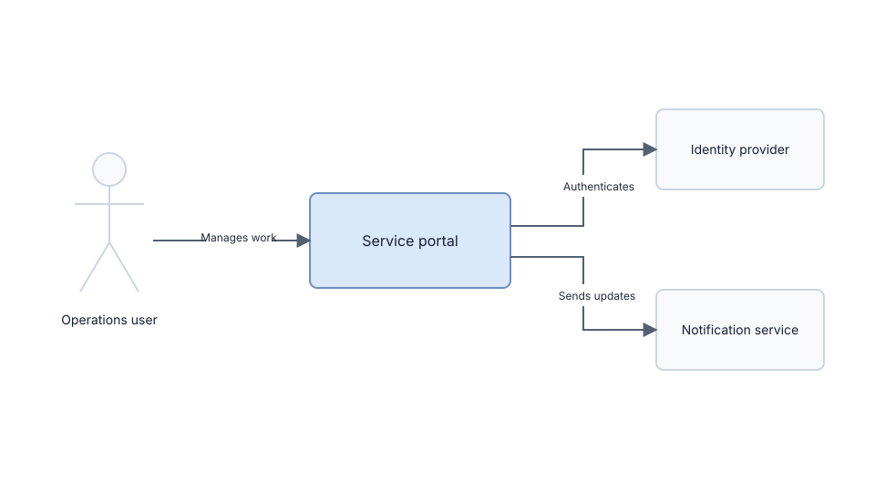

# Example System Context Diagram

## Bundle

- Source: `sources/example-system-context.drawio`
- Export: `exports/example-system-context.svg`
- Diagram type: C4-style system context
- Palette: fallback palette roles from `assets/default-palette.json`
- Visual QA status: example SVG reviewed for spacing, readable labels, and
  valid arrow termination

## Writerside Reference

```md

```
